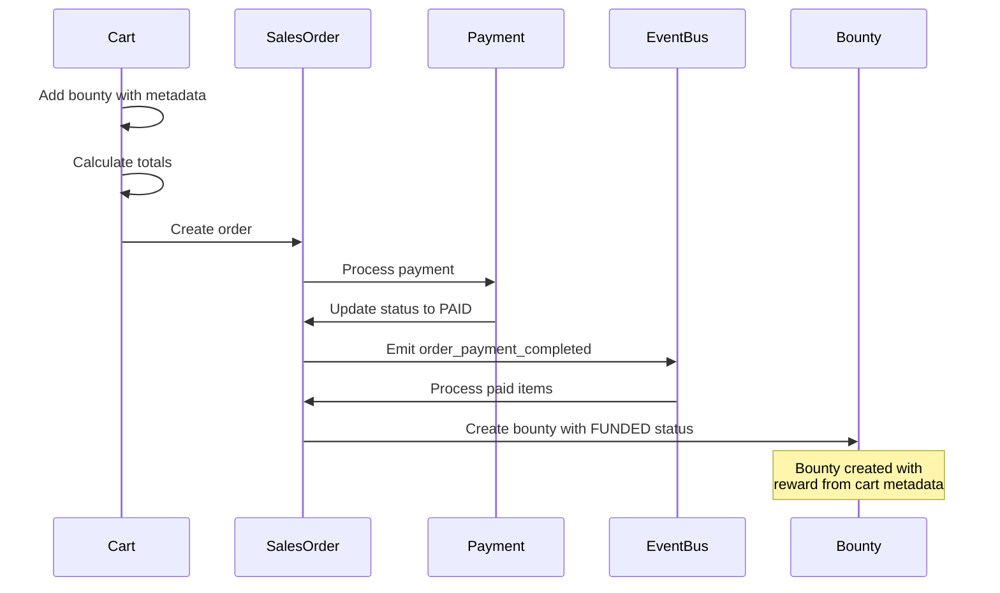

# Commerce Flow: Cart to Bounty Creation

This document describes the complete flow from cart creation through to bounty creation, including the data transfer objects used in the process.

## Overview

The commerce flow handles the process of purchasing bounties, managing payments, and creating funded bounties. The process is designed to be atomic and maintain data consistency through database transactions.

## Data Transfer Objects

### BountyPurchaseData

This DTO validates and standardizes bounty data throughout the purchase process. It includes the following fields:

- id: str - Unique identifier
- product_id: str - Associated product identifier
- title: str - Bounty title
- description: str - Bounty description
- reward_type: RewardType (USD or POINTS)
- reward_in_usd_cents: Optional[int] - USD reward amount in cents
- reward_in_points: Optional[int] - Points reward amount
- status: BountyStatus - Current bounty status

The DTO includes validators to ensure:
- Reward amounts are non-negative
- USD rewards must specify reward_in_usd_cents
- POINTS rewards must specify reward_in_points

## Process Flow Diagram



## Process Flow

### 1. Cart Creation and Management

When a bounty is added to cart:
- CartService validates the cart is open
- Checks bounty status is DRAFT
- Prevents duplicate bounties in cart
- Creates cart line item with bounty metadata
- Updates cart totals including fees and taxes

### 2. Sales Order Creation

When checkout is initiated:
- Creates new sales order linked to cart
- Copies line items from cart
- Calculates final totals
- Sets initial status as PENDING

### 3. Payment Processing

During payment:
- Processes payment (implementation varies by payment provider)
- On success:
  - Updates order status to PAID
  - Emits order_payment_completed event with sales order ID

### 4. Post-Payment Processing

The event listener triggers:
- Processes each bounty line item
- Creates funded bounties via BountyService
- Updates line items with bounty references

### 5. Bounty Creation

Final step:
- Creates new bounty with FUNDED status
- Copies details from cart item metadata
- Returns bounty ID for reference

## Error Handling

The system includes comprehensive error handling:

1. Cart Validation
   - Checks for open cart status
   - Validates bounty availability
   - Prevents duplicate items

2. Sales Order Validation
   - Ensures cart exists and is valid
   - Validates totals and line items
   - Checks organisation wallet balance

3. Payment Processing
   - Handles payment failures
   - Maintains transaction atomicity
   - Logs detailed error information

4. Post-Payment Processing
   - Handles bounty creation failures
   - Maintains audit trail
   - Emits failure events when needed

## Database Transactions

All critical operations are wrapped in database transactions to ensure data consistency:
- Cart updates
- Sales order creation
- Payment processing
- Bounty creation

## Monitoring and Logging

The system includes comprehensive logging:
- Cart modifications
- Payment processing
- Event emissions
- Error conditions

Logs are structured to facilitate debugging and monitoring of the commerce flow.

### Bounty Creation with Funded Status
**Decision**: Create bounties in FUNDED status with reward details from successful payment
**Rationale**:
- Bounty is created only after successful payment
- Reward amount and type are set directly from the paid cart item:
  ```python
  bounty = Bounty.objects.create(
      product_id=product_id,
      title=cart_item_data['metadata']['title'],
      description=cart_item_data['metadata']['description'],
      status=Bounty.BountyStatus.FUNDED,
      reward_type=cart_item_data['metadata']['reward_type'],
      reward_in_usd_cents=cart_item_data['unit_price_usd_cents'],
      reward_in_points=cart_item_data['unit_price_points']
  )
  ```
- Ensures reward amount matches exactly what was paid
- Maintains single source of truth for bounty value
- Supports both USD and Points reward types
- Creates clear audit trail from payment to bounty
- Prevents discrepancies between paid amount and bounty reward

This approach ensures that bounties are always created with their final, funded reward amount, and the reward type matches the payment method used. The bounty's FUNDED status indicates it's ready for claims, having already received the necessary financial backing.

### Line Item Metadata Pattern
**Decision**: Store bounty details as metadata on cart/order line items
**Rationale**:

1. **Data Flow**
```python
# During cart addition, metadata is stored from BountyPurchaseData
CartLineItem.objects.create(
    cart=cart,
    item_type=CartLineItem.ItemType.BOUNTY,
    quantity=quantity,
    unit_price_usd_cents=bounty_data.reward_in_usd_cents,
    unit_price_points=bounty_data.reward_in_points,
    metadata=bounty_data.dict(
        exclude={'status'},  # Don't include status in metadata
        exclude_none=True    # Don't include None values
    )
)
```

2. **Key Benefits**:
- Preserves original bounty parameters through the purchase flow
- Allows cart/order to be self-contained without external references
- Supports price changes without affecting existing cart items
- Enables creation of bounty without querying external services
- Maintains historical record of purchase intent

3. **Metadata Structure**:
- product_id: Links to product without foreign key constraint
- title: Bounty title at time of purchase
- description: Bounty description at time of purchase
- reward_type: USD or POINTS
- Additional bounty-specific fields as needed

4. **Design Considerations**:
- Status is explicitly excluded as it's managed by the commerce flow
- None values are excluded to minimize storage
- Metadata is immutable once created
- JSON structure allows for flexible schema evolution

This pattern ensures that all information needed to create the bounty is captured at cart creation time and remains consistent throughout the purchase process, while maintaining a clean separation between commerce and product domains.
